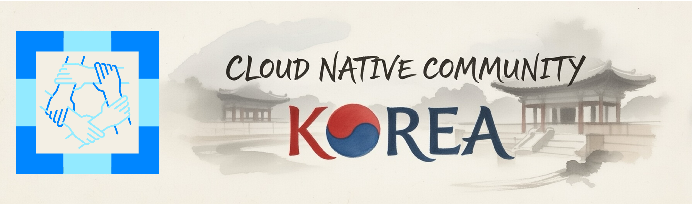

  

  <a href="https://www.linkedin.com/groups/15310024/">LinkedIn</a>

# CNCK Community

[**Cloud Native Community Korea (CNCK)**](https://community.cncf.io/cloud-native-community-korea/) 는 클라우드 네이티브 기술의 한국 내 확산과 성장을 위해 활동하는 [CNCF (Cloud Native Computing Foundation)](https://www.cncf.io/) 공식 커뮤니티 그룹입니다.

## Objective

- **Cloud Native 기술 대중화** — 한국 IT 커뮤니티에 Cloud Native 개념과 기술을 알리고 실무 적용을 돕습니다.
- **오픈소스 생태계 기여** — CNCF 프로젝트 및 Cloud Native 오픈소스 프로젝트에 대한 기여를 장려하고 지원합니다.
- **실무 중심 지식 공유** — 프로덕션 환경의 경험과 노하우를 공유하여 Cloud Native 기술의 실질적인 도입을 촉진합니다.
- **커뮤니티 네트워킹** — Cloud Native에 관심 있는 엔지니어, 개발자, 운영자 간의 네트워크를 형성하고 협업을 활성화합니다.

## 커뮤니티 차별성

- **CNCF 공식 커뮤니티** — CNCF와의 공식 연계를 통해 글로벌 Cloud Native 생태계와 직접 연결됩니다.
- **SIG 기반 운영** — 관심 분야별 Special Interest Group(SIG)을 통해 깊이 있는 기술 탐구와 지속적인 활동을 지원합니다.
- **오픈 거버넌스** — 커뮤니티 운영 전반이 공개되어 있으며 누구나 의사결정 과정에 참여할 수 있습니다.

## SIG (Special Interest Groups)

| SIG | 설명 |
|-----|------|
| TBD | TBD |

## 참여 방법 (How to Contribute)

CNCK 커뮤니티 활동에 참여하고 GitHub 조직 멤버가 되려면 아래 조건 중 하나 이상을 충족해야 합니다:

- 분기당 이벤트 1회 이상 참석
- SIG 활동 월 1회 이상 참여
- 콘텐츠 기여 (뉴스레터 기고, 발표 자료 공유 등) 분기 1회 이상

조건을 충족하셨다면 [GitHub 조직 멤버 가입 신청](../../issues/new?template=membership-request.yml) 이슈를 통해 신청해 주세요.

## Code of Conduct

CNCK 커뮤니티는 [CNCF Community Code of Conduct v1.3](code-of-conduct.md)을 따릅니다. 모든 참여자는 행동 강령을 숙지하고 준수해 주시기 바랍니다.

---

  <strong>Cloud Native Community Korea</strong> 
  CNCF 공식 커뮤니티 그룹

